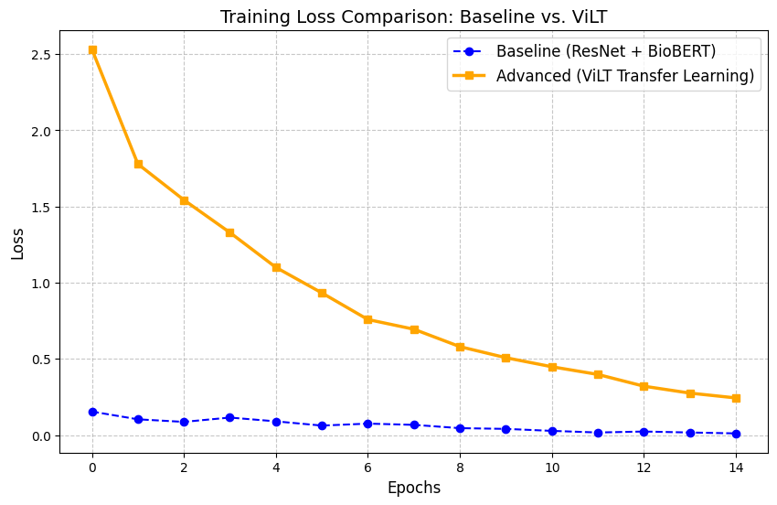
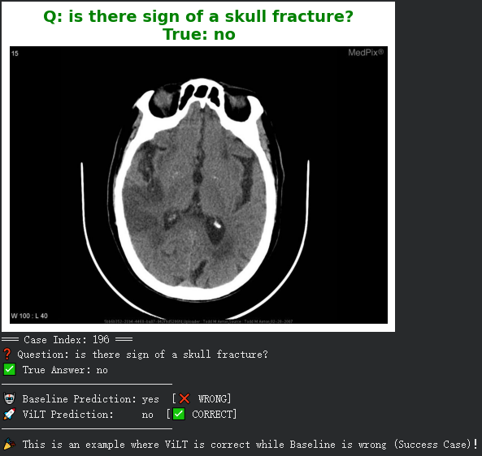

# 🏥 Med-VQA: Comparative Analysis of CNN-BERT and ViLT

**Course:** WOA7015 Advanced Machine Learning (Alternative Assignment)  
**Institution:** Universiti Malaya  
**Semester:** 2024/2025  

---

## 📖 Project Overview
This repository contains the implementation and experimental results for the **Medical Visual Question Answering (Med-VQA)** assignment. 

The objective of this project is to compare two distinct deep learning approaches for answering natural language questions based on medical images (X-rays, CTs, MRIs):
1.  **Method A (Strong Baseline):** A modular architecture combining **ResNet-50** (Vision) and **Bio_ClinicalBERT** (Language).
2.  **Method B (Advanced):** A Transformer-based Visual-Language Model (**ViLT**) utilizing Transfer Learning.

We evaluate both models on the **VQA-RAD** dataset to analyze their performance on closed-ended (Yes/No) and open-ended (Descriptive) clinical questions.

---

## 🧠 Model Architectures

### 1. Baseline Model: CNN-BERT Hybrid
Instead of a standard CNN-RNN baseline, we implemented a robust baseline integrating domain-specific embeddings:
* **Visual Encoder:** `ResNet-50` (pre-trained on ImageNet), extracting 2048-d feature vectors.
* **Text Encoder:** `Bio_ClinicalBERT` (pre-trained on MIMIC-III data), extracting 768-d semantic vectors.
* **Fusion:** Late fusion via concatenation followed by a Multi-Layer Perceptron (MLP).

### 2. Advanced Model: ViLT (Vision-and-Language Transformer)
We utilized the **ViLT** architecture, which treats image patches and text tokens as a unified sequence:
* **Mechanism:** Single-stream Transformer with Self-Attention (Early Fusion).
* **Initialization:** Fine-tuned from `dandelin/vilt-b32-finetuned-vqa` to leverage prior VQA knowledge.
* **Advantage:** Allows deep cross-modal interaction from the first layer.

---

## 📊 Experimental Results

We trained both models on the **VQA-RAD** dataset for 15 epochs. 

### Quantitative Comparison

| Model | Overall Accuracy | Closed-ended (Yes/No) | Open-ended (Descriptive) |
| :--- | :---: | :---: | :---: |
| **Baseline (ResNet + BioBERT)** | 59.18% | 63.75% | 41.54% |
| **ViLT (Transformer)** | **60.13%** | **64.14%** | **44.62%** |

> **Key Finding:** While both models perform similarly on binary classification (Closed-ended), **ViLT outperforms the Baseline by ~3% on Open-ended questions**. This suggests that Transformer-based architectures are significantly better at understanding complex medical semantics and generating descriptive answers compared to traditional modular approaches.

### Training Convergence
The loss curves below demonstrate that ViLT (Orange) benefits from transfer learning, showing faster and more stable convergence compared to the Baseline (Blue).


*(Note: Please refer to the `images/` folder if the image does not render)*

---

## 🖼️ Qualitative Analysis

### Success Case: ViLT vs. Baseline
In this example (Index 196), the user asks: *"Is there sign of a skull fracture?"*

* **Ground Truth:** `no`
* **Baseline Prediction:** `yes` ❌ (Likely overfitting to the word "fracture")
* **ViLT Prediction:** `no` ✅



This demonstrates ViLT's superior ability to ground the textual query in the visual evidence, avoiding common language biases found in the baseline.

---

## 🛠️ Installation & Usage

To reproduce the experiments, you can run the provided Jupyter Notebook.

### Prerequisites
* Python 3.8+
* PyTorch (CUDA recommended)
* Transformers (Hugging Face)
* Datasets, Pillow, Matplotlib

### Quick Start
1.  **Clone the repository:**
    ```bash
    git clone (https://github.com/Ce1es/7015-Alternative-Assignment.git)
    cd Med-VQA-Project
    ```

2.  **Install dependencies:**
    ```bash
    pip install torch torchvision transformers datasets matplotlib pillow
    ```

3.  **Run the Notebook:**
    Open `Medical_VQA_Comparison.ipynb` in Jupyter Lab or Google Colab and execute all cells. The notebook includes:
    * Data preprocessing (with Top-K answer filtering).
    * Model definitions (ResNet-BERT & ViLT).
    * Training loop.
    * Evaluation & Visualization scripts.

---

## 📂 File Structure

* `Medical_VQA_Comparison.ipynb`: The main executable notebook containing end-to-end code.
* `training_loss_curve.png`: Visualization of training performance.
* `Success_Case_196.png`: Sample prediction visualization.
* `README.md`: Project documentation.

---

## 👥 Contributors

* **Jiang Wei** - *Model Implementation & Experiments*
* **Zeng Penghui** - *Report Writing & Analysis*

---
